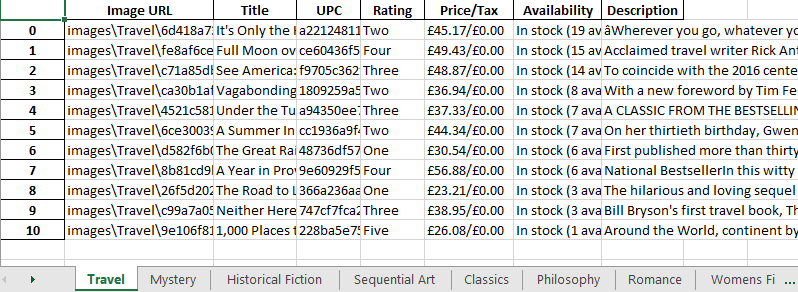

# <div align="center">Data Scraping </div>
## Books to scrape
[**books.toscrape.com**][books_toscrape] is a web-page designed to practice web scraping.
It is based on an online book store with book covers, titles, ratings, etc.

The script creates an Excel file with multiple sheets sorted by categories.
The sheets contain data of each book listed on a current category. Name of the columns are:
- Image URL;
- Title;
- UPC;
- Rating;
- Price/Tax;
- Availability;
- Description.

To run the script type in terminal:
```sh
python books_toscrape/main.py
```

After the script is done, it leaves us with an Excel file ``books.xlsx`` and ``images`` folder with all book covers 
sorted by categories.

<p align="center"></p>

[books_toscrape]: https://books.toscrape.com/
